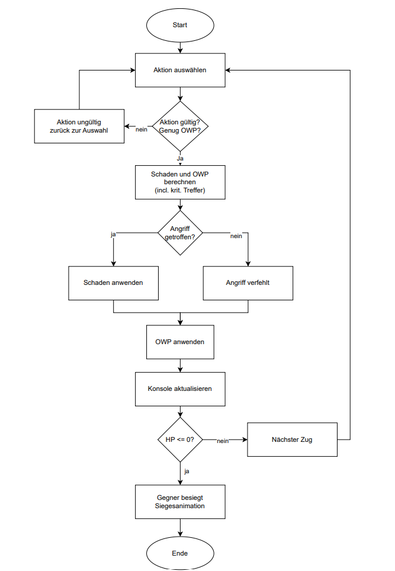

# Extreme Combat RPG

> Ein rundenbasiertes RPG‑Kampfsystem mit unterschiedlichen Charakteren und taktischen Entscheidungen.

## 1. Projektbeschreibung

**Zweck:**  
Im Rahmen der obligatorischen Seminarwoche Software‑Entwicklung haben wir den Auftrag erhalten, in einem Team ein Softwareprojekt zu realisieren. Wir haben uns für ein funktionierendes RPG‑Kampfsystem entschieden.  
- Unterschiedliche Charaktere mit Basis‑Attributen  
- Konsolen‑Menü zur Aktionsauswahl  
- Siegesanimation am Ende jedes Kampfes  

## 2. Use Case: Kampffunktion

**UC‑Name:** Kampffunktion  
**Umfang:** Interaktion des Spielers während eines Kampfes (Angriff, Verteidigung), Schadensermittlung, Status‑Update auf der Konsole.  
**Akteure:**  
- **Spieler:** Möchte Gegner besiegen.  
- **System/Entwickler:** Muss Kampfregeln korrekt anwenden.

**Vorbedingungen:**  
1. Beide Spieler haben Charaktere ausgewählt.  
2. Die Konsole zeigt das Kampf‑Interface.

**Erfolgsgarantie:**  
- Kampfaktion ausgeführt  
- HP/OWP der Charaktere aktualisiert  
- Nächster Zug vorbereitet

**Standardablauf:**
1. Spieler wählt Aktion (z.B. „Schwertangriff“).  
2. System validiert Aktion.  
3. Schaden wird berechnet (Basis‑Wert + Würfelwurf).  
4. Gegner‑HP werden reduziert.  
5. Konsole zeigt aktuellen Status.  
6. Prüfung auf Sieg/Niederlage.  
7. Zug wechselt zum nächsten Spieler.

**Erweiterungen:**
- Ungültige Aktion → Fehlermeldung → zurück zu Schritt 1  
- Angriff verfehlt (Wurf = 1)  
- Kritischer Treffer (Wurf = 20)  
- Gegner besiegt → Siegesanimation

## 3. Flussdiagramm der Kampffunktion:**

## 4. Schematische Darstellung des Codes

Dieser Abschnitt gibt einen Überblick über die Struktur des Codes und die wichtigsten Komponenten/Module.

**Architekturmuster:**  
Einfaches prozedurales Muster mit Datenstrukturen (Structs/Klassen) und Funktionen in Modulen (`.cpp/.h`‑Paare).  

**Hauptkomponenten/-module:**  
- `main.cpp`: Einstiegspunkt, Hauptmenü‑Logik.  
- `StartScreen.cpp/.h`: Anzeige des Startbildschirms.  
- `Charaktere.cpp/.h`: Definiert die `Character`‑Klasse und `AttackData`, initialisiert verfügbare Charaktere.  
- `Datenstrukturen.cpp/.h`: Definiert `Player`‑Struktur, Hilfsfunktionen (Zufall, Eingabe, Pause) und Charakterauswahl-Logik.  
- `Kampf.cpp/.h`: Implementiert die rundenbasierte Kampflogik (`startCombat`).  
- `Charakterinformationen.cpp/.h`: Zeigt detaillierte Informationen aller Charaktere an.  

**Abhängigkeiten:**  
- `main` nutzt alle Module.  
- `Kampf` nutzt `Datenstrukturen` (inkl. `Charaktere`).  
- `Datenstrukturen` nutzt `Charaktere`.  
- `Charakterinformationen` nutzt `Charaktere`.  
- Alle Module verwenden Standardbibliotheken (`iostream`, `vector`, `string`, etc.). :contentReference[oaicite:3]{index=3}

## 5. Anleitung zum Programm

**Spielablauf:**  
1. **Startbildschirm:**  
   - Titel „EXTREME COMBAT“ und Credits.  
   - `Enter` drücken, um fortzufahren.  
2. **Hauptmenü:**  
   1. Spiel starten  
   2. Charakter‑Info anzeigen  
   3. Würfelwahl (Standard: D20)  
   4. Beenden  
   Eingabe der gewünschten Zahl + `Enter`.  
3. **Charakter‑Info anzeigen (Menü 2):**  
   - Liste aller Charaktere mit Werten (HP, DEF) und Angriffen.  
   - `Enter` zurück zum Hauptmenü.  
4. **Spiel starten (Menü 1):**  
   - **Charakterauswahl & Namenseingabe Spieler 1:** Nummer eingeben → `Enter` → mit `j` bestätigen oder `n` erneut auswählen. Standardname: „Spieler 1“.  
   - **Charakterauswahl & Namenseingabe Spieler 2:** Wie oben.  
   - Kampf beginnt.  
5. **Kampf:**  
   - **Rundenablauf:** Zufällige Bestimmung des Startspielers.  
   - **Zugbeginn:** + 10 OWP, Anzeige von HP & OWP beider Spieler.  
   - **Aktionswahl:**  
     1. Angriff 1 (Kosten: 5 OWP)  
     2. Angriff 2 (Kosten: Basis‑Schaden als OWP)  
     3. Verteidigen (0 OWP, + 5 Def‑Bonus, + 5 OWP)  
     Eingabe von `Exit` beendet das Spiel sofort.  
   - **Schadensberechnung:**  
     - OWP abziehen.  
     - Beide würfeln D20 (Standard).  
     - **Schaden =** BasisSchaden + eigener Wurf – Gegnerwurf – GegnerDefBonus.  
     - Wurf = 20 → Kritischer Treffer (~×1,5 Schaden).  
     - Wurf = 1 → Fehlschlag (0 Schaden).  
     - Endgültiger Schaden wird durch Basis‑Verteidigungswert reduziert.  
   - **Zugende:** Gegner ist am Zug.  
   - **Sieg/Niederlage:** HP ≤ 0 → Gewinner bekanntgeben + Pokal‑Grafik.  
   - `Enter` → Rückkehr zum Hauptmenü.  
6. **Beenden (Menü 4):** Spiel beenden. :contentReference[oaicite:4]{index=4}

## 6. Fehlerbehebung

- **Spiel startet nicht:** Stelle sicher, dass die Kompilierung erfolgreich war und alle Laufzeitbibliotheken vorhanden sind.  
- **Falsche Zeichen/Umlaute:** Konsole auf UTF‑8 setzen (z. B. Windows: `chcp 65001`). :contentReference[oaicite:5]{index=5}&#8203;:contentReference[oaicite:6]{index=6}
